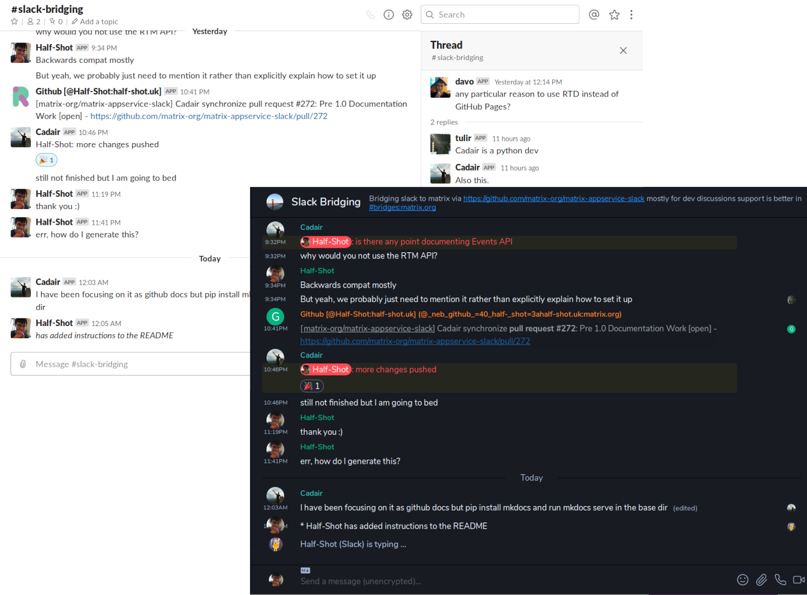

# matrix-appservice-slack

## This repository is archived

The public Matrix.org Slack bridge has been decommissioned on January 14th, 2026. Please see the following
[blog post](https://matrix.org/blog/2025/11/removing-slack-bridge/) for details.

Due to this, there will be no more development effort going into maintaining this bridge.

## Description

A bridge that connects [Matrix](https://matrix.org) and [Slack](https://slack.com). 
The bridge was considered **stable** and mature for use in production, but has been discontinued.
environments.

## Requirements

Hosting this bridge requires you to have a Matrix homeserver. In order to
connect a Slack Workspace to your bridge, you will need permission to add bots
to it. You will also need Node.JS 16+ or Docker on your system.

**NOTE:** Slack has introduced a new type of 'Slack App', which is not compatible with this bridge. Instead, you will need to [create a "Classic Slack App"](https://api.slack.com/apps?new_classic_app=1) for this bridge. Existing installations will not need to modify their setups, as all pre-existing Slack apps became Classic Slack apps. We are looking to make the bridge compatible with both types, but in the meantime please only use Classic Slack Apps.

## Setting up

See [the getting started docs](https://matrix-appservice-slack.rtfd.io/en/latest/getting_started)
for instructions on how to set up the bridge.

## Helping out

This bridge is a community project and welcomes issues and PRs from anyone who
has the time to spare. If you want to work on the bridge, please see
[CONTRIBUTING.md](https://github.com/matrix-org/matrix-appservice-slack/blob/develop/CONTRIBUTING.md).
