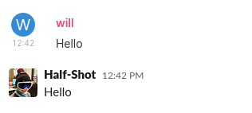
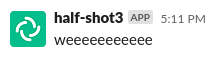

Puppeting
=========

Puppeting is the ability to link your Matrix identity with your Slack 
identity, and send messages as if you were talking from Slack.

>   
> A message sent from Element appearing as a native Slack message

While the bridge supports sending messages as itself on behalf of users 
(including setting an avatar and name), there are limits to its abilities. 
An "[APP]" logo will appear next  to your messages, and users are not able 
to DM you or invite you to chats.


>   
> A message sent from Element appearing as a bot message.

Puppeting also allows the bridge to connect you to channels that the bridge 
would otherwise not be able to access, such as DMs and private channels.

## Setting up the bridge

You will need to configure the bridge to support puppeting before you can 
make use of it.

The minimal set of configuration you will need is:

```yaml
puppeting:
  enabled: true

rtm:
  enable: true

oauth2:
  client_id: "12345.12345"
  client_secret: "abcdef12345"
  redirect_prefix: "https://yourexternaladdress/"
```

You must enable puppeting and RTM support. RTM support means the bridge will 
use websockets to communicate with the bridge rather than HTTP pushed events.

Finally, you must have OAuth2 configured. OAuth2 is used to authenticate
users with Slack and get the required access tokens in order to puppet   
accounts. `client_id` and `client_secret` can be found on the OAuth page 
of your Slack App (under https://api.slack.com/apps). Ensure you have all the
correct permission scopes. (see
[OAuth2.ts](https://github.com/matrix-org/matrix-appservice-slack/blob/118b931afbd1e2387128d1b5c46bd0e2787ad51c/src/OAuth2.ts#L31-L40)
for an up-to-date list)
For this to work, the bridge must be listening for external HTTP 
requests on the port configured by `slack_hook_port`. A load balancer 
should be used for this.

You must also ensure that you have configured Redirect URLs on your Slack 
App to contain the URL provided in `redirect_prefix`. You must also update 
your Request URL in Event Subscriptions. Ensure the bridge is started, 
otherwise Slack will not be able to verify the URL.

Once this is all configured, you are ready to start puppeting.

## Connecting your account

Connecting your account is a simple affair. You need to message the bridge 
bot, which will be `@{sender_localpart}:yourdomain` in a private direct 
message on Matrix. The `sender_localpart` will be in your registration file.
Send the bot the command `login` and follow the link provided.

Once you've completed that step, your messages will now arrive through the 
bridge. You are also free to disable access to the HTTP listener configured 
above **IF** you do not wish to puppet any other users.

## Extra configuration

You may configure additional options if your circumstances require it.

### Deny some users the ability to direct message

If you wish to deny some users the ability to send direct messages,
you can use this configuration below. You can use `allow`|`deny`
to choose who is allowed or denied, and `matrix`|`slack` to identify
which type you wish to block. Strings surrounded by `/` are treated
as regex strings, otherwise they are treated as complete identifiers.

```yaml
puppeting:
  direct_messages:
    deny:
      matrix:
        - /^@evil/
```

For example, this configuration would block users who have a user_id starting
with `@evil` from messaging Slack users.

## Notes


The offical Matrix.org bridge does not support puppeting or private channels.
We suggest you either self-host, or find a provider for this bridge.
