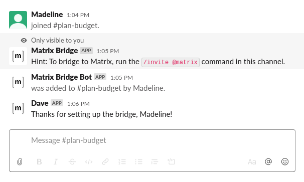

Workspace Sync
==============

The term Team is synonymously used for a Slack Workspace.

The configuration option `team_sync` allows to replicate channels and users from Slack to Matrix before a user writes a message. To have a consistent experience across both sides of the bridge, it is recommended to have this feature enabled.

## Table of supported events

| Event | Without Team Sync | With Team Sync |
|---|---|---|
| A channel gets created | not replicated | the channel admin gets a message on how to bridge the channel |
| A channel gets deleted | not replicated | immediately replicated |
| A user joins a channel | added on their first message | immediately replicated |
| A user leaves a channel | not replicated | immediately replicated |
| A user's profile gets updated (e.g. Display name) | updated on their next message | immediately replicated |


## Configuration

Team Sync can be configured with the `team_sync` object in `config/config.yaml`.

A bridge can be configured to sync channels and users of a Slack Workspace. When the bridge runs, a hint will be posted to existing and new Slack channels. The hint explains that the channel can be bridged by inviting the Matrix bot.

```yaml
team_sync:
  # Entry for a single team
  T0123ABCDEF:
    channels:
      enabled: true
      # Optional blacklist for channel ids. Trumps the whitelist.
      blacklist:
      - CVCCPEY9X
      - C0108F9K37X
      # Optional whitelist for channel ids.
      # whitelist: ['CVCCPEY9X']
      # Prefix for room aliases in Matrix
      alias_prefix: "slack_"
    # Should sync *all* team users to Matrix
    users:
      enabled: true
  # Defaults for all other teams
  all:
    channels:
      enabled: false
```

If not all channels shall be replicated, one may define an optional blacklist or whitelist of channel ids. If both a blacklist and a whitelist are defined, the blacklist takes precedence.

The display name of the Matrix room will be identical to the one in Slack. Use the optional key `alias_prefix` to prevent conflicts with existing Matrix room aliases. Given the example above, a channel `#general` would get the alias address `#slack_general:your-homeserver.org`.

## For channel admins

Existing and new rooms will receive a message for setting up the bridge. This message is only visible to the channel admin.


